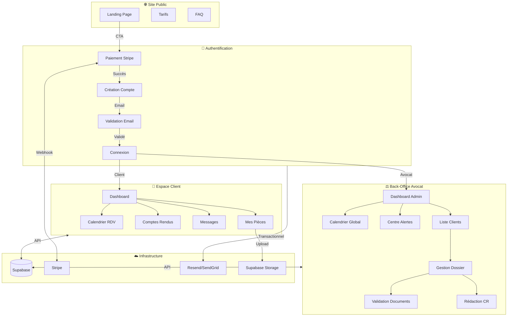
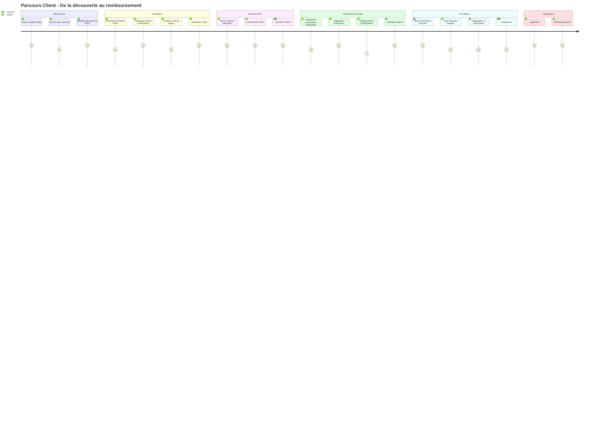
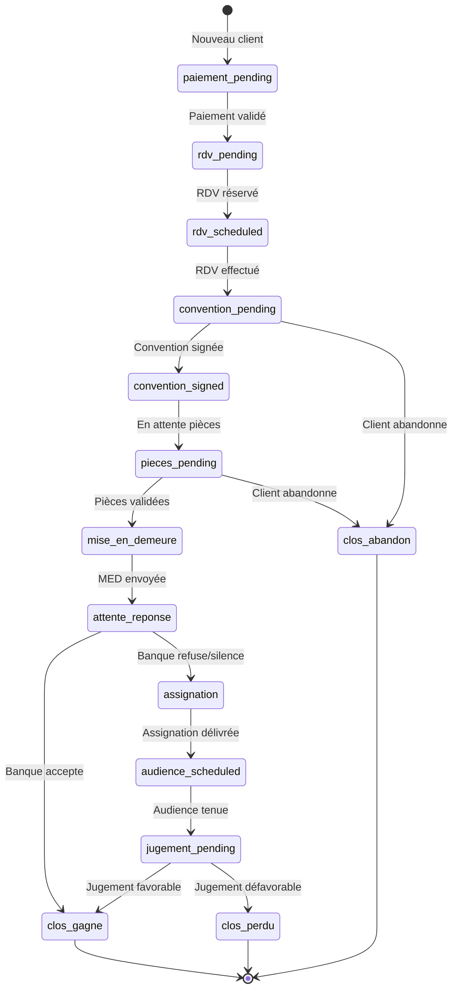
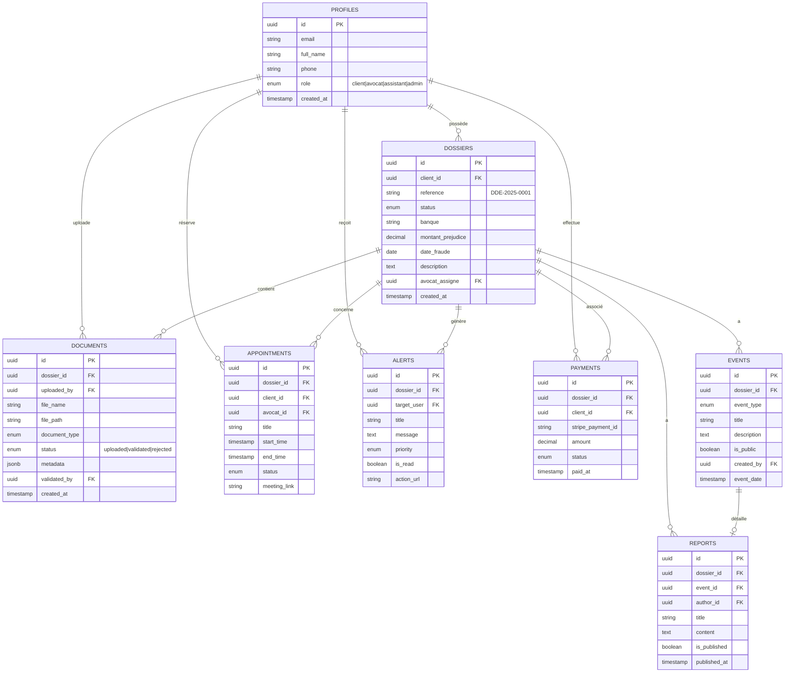
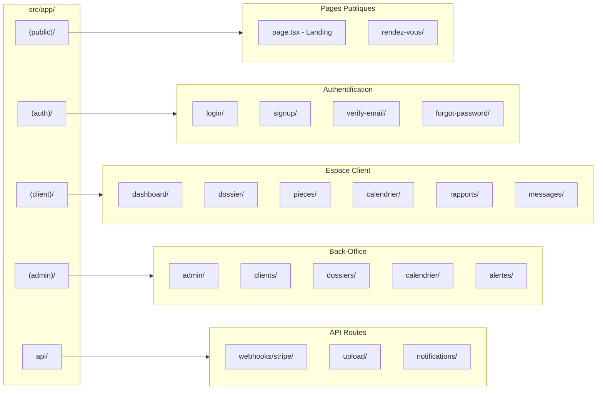
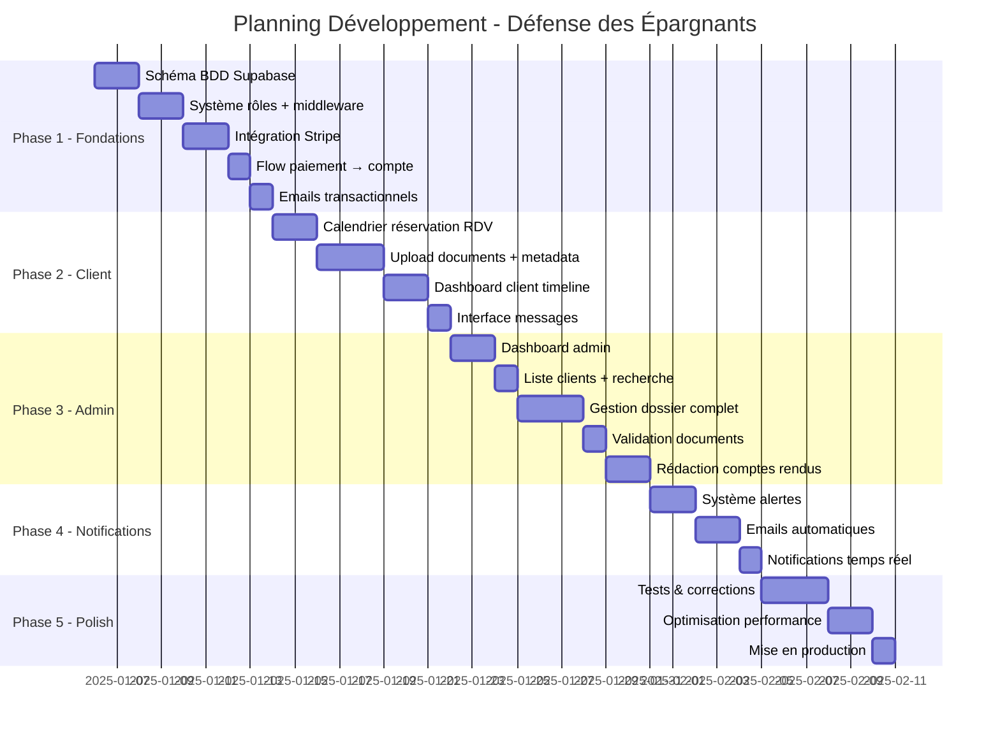

# 📋 Plan de Développement - Défense des Épargnants

## 🎯 Vision Produit

Plateforme permettant aux victimes de fraude bancaire d'accéder à une assistance juridique professionnelle à tarif accessible, grâce à l'automatisation par IA sous contrôle humain.

---

## 🏗️ Architecture Globale

---

## 👥 Parcours Utilisateur Client

---

## 🔄 États du Dossier

---

## 🗄️ Modèle de Données

---

## 📁 Structure des Fichiers

---

## 🚀 Phases de Développement

---

## ✅ Checklist par Phase

### Phase 1 - Fondations (8 jours)
- [ ] Créer les tables Supabase (profiles, dossiers, documents, events, etc.)
- [ ] Configurer Row Level Security (RLS) pour chaque table
- [ ] Implémenter le middleware de protection des routes par rôle
- [ ] Configurer Stripe (produit, prix, webhook)
- [ ] Créer la page de paiement
- [ ] Implémenter le webhook Stripe (création compte post-paiement)
- [ ] Configurer Resend pour les emails transactionnels
- [ ] Email de bienvenue + validation

### Phase 2 - Espace Client (8 jours)
- [ ] Système de créneaux disponibles
- [ ] Interface de réservation RDV
- [ ] Confirmation + rappels email
- [ ] Upload de fichiers vers Supabase Storage
- [ ] Formulaire métadonnées documents
- [ ] Liste des documents avec statuts
- [ ] Dashboard avec timeline dossier
- [ ] Affichage comptes rendus publiés
- [ ] Interface de messagerie simple

### Phase 3 - Back-Office (9 jours)
- [ ] Dashboard admin avec KPIs
- [ ] Liste clients avec filtres et recherche
- [ ] Vue détaillée dossier client
- [ ] Interface validation/rejet documents
- [ ] Éditeur de comptes rendus (Markdown)
- [ ] Publication vers client
- [ ] Calendrier vue globale (tous les RDV)
- [ ] Modification statut dossier

### Phase 4 - Notifications (5 jours)
- [ ] Table des alertes
- [ ] Génération automatique d'alertes
- [ ] Centre de notifications admin
- [ ] Emails automatiques (rappels, mises à jour)
- [ ] Notifications temps réel (Supabase Realtime)

### Phase 5 - Finalisation (6 jours)
- [ ] Tests end-to-end parcours client
- [ ] Tests end-to-end parcours admin
- [ ] Correction bugs
- [ ] Optimisation images et assets
- [ ] Configuration production Vercel
- [ ] Domaine personnalisé + SSL
- [ ] Monitoring (Sentry ou similaire)

---

## 📊 KPIs à Suivre

| Métrique | Objectif Phase 1 |
|----------|------------------|
| Clients inscrits | 100 |
| Taux conversion landing → paiement | 5% |
| RDV planifiés | 80 |
| Documents uploadés | 500 |
| Dossiers en cours | 50 |

---

## 🔐 Sécurité

- **Authentification** : Supabase Auth (JWT)
- **Autorisation** : Row Level Security (RLS) + middleware Next.js
- **Paiement** : Stripe (PCI DSS compliant)
- **Stockage** : Supabase Storage (buckets privés)
- **Emails** : Resend (SPF/DKIM configurés)
- **HTTPS** : Vercel (automatique)
- **RGPD** : Consentement + droit à l'oubli à implémenter

---

## 🛠️ Stack Technique

| Composant | Technologie |
|-----------|-------------|
| Frontend | Next.js 16 + React 19 |
| Styling | Tailwind CSS + Shadcn/UI |
| Backend | Supabase (PostgreSQL + Auth + Storage) |
| Paiement | Stripe |
| Emails | Resend |
| Hébergement | Vercel |
| IA | OpenAI API (classification documents) |

