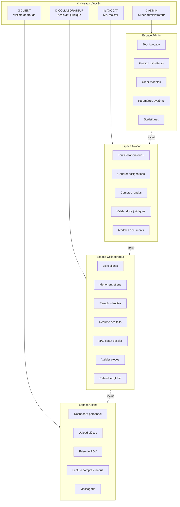
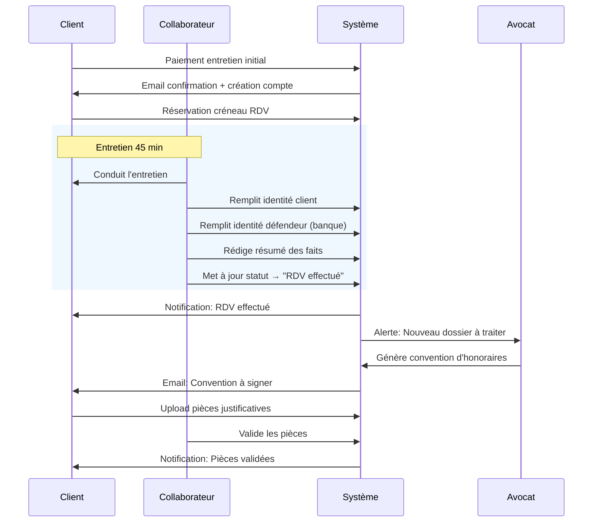
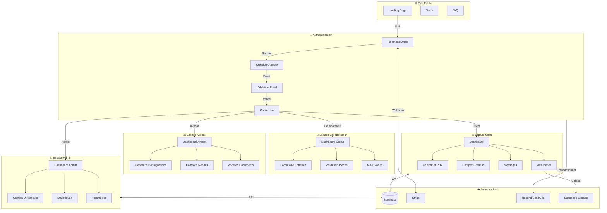
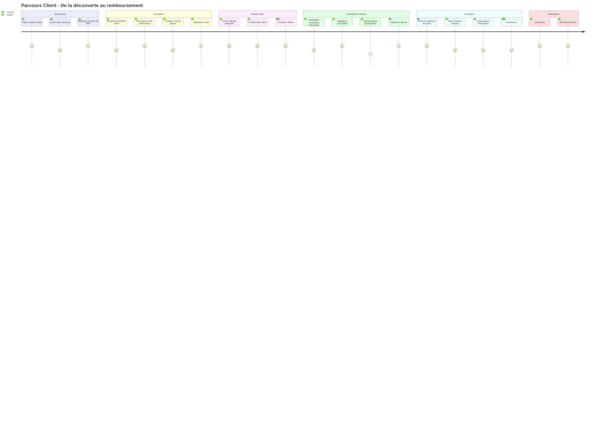
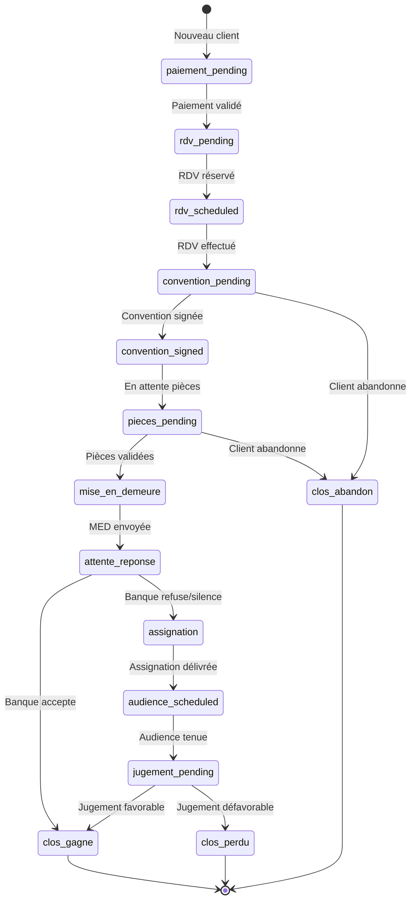
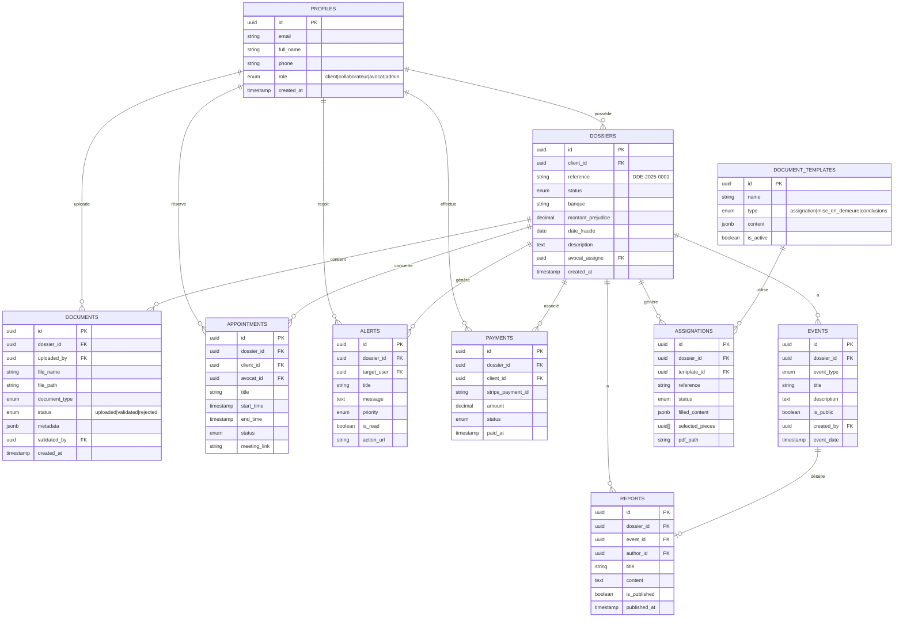
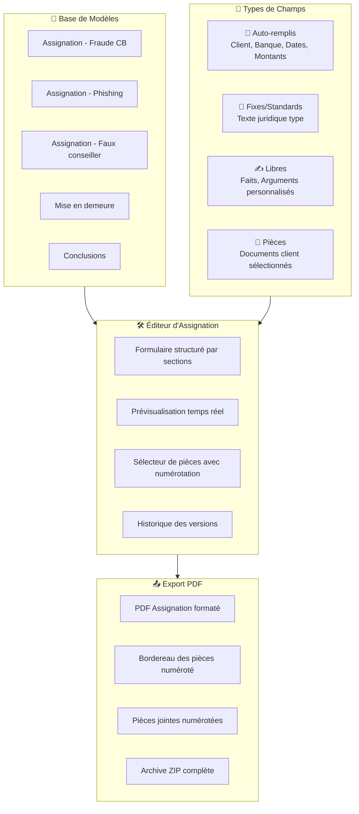
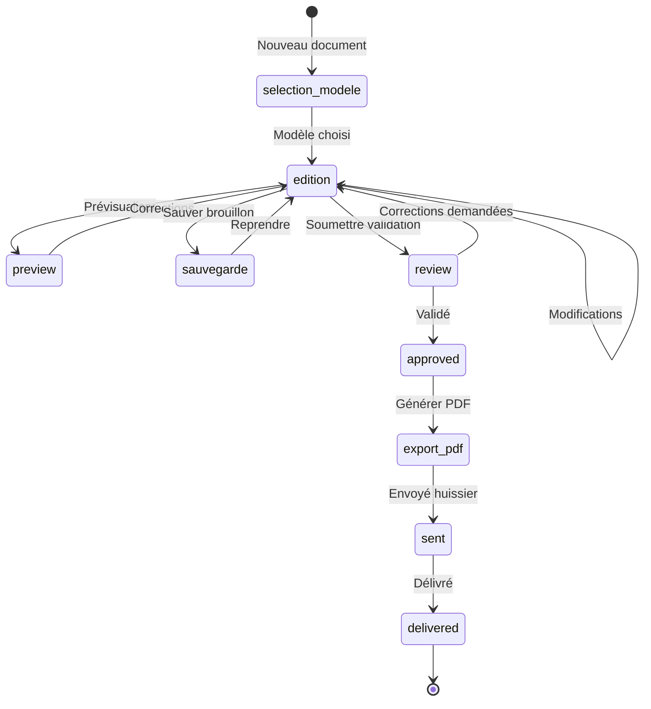
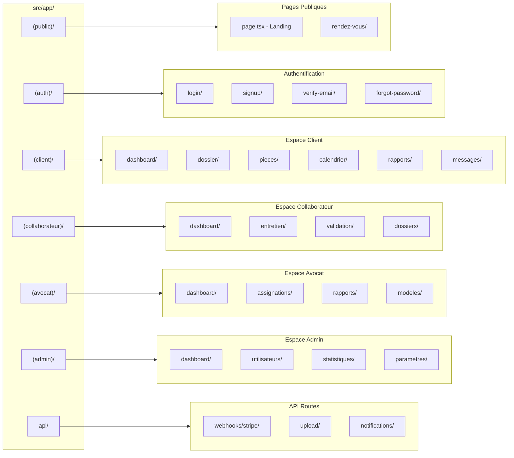
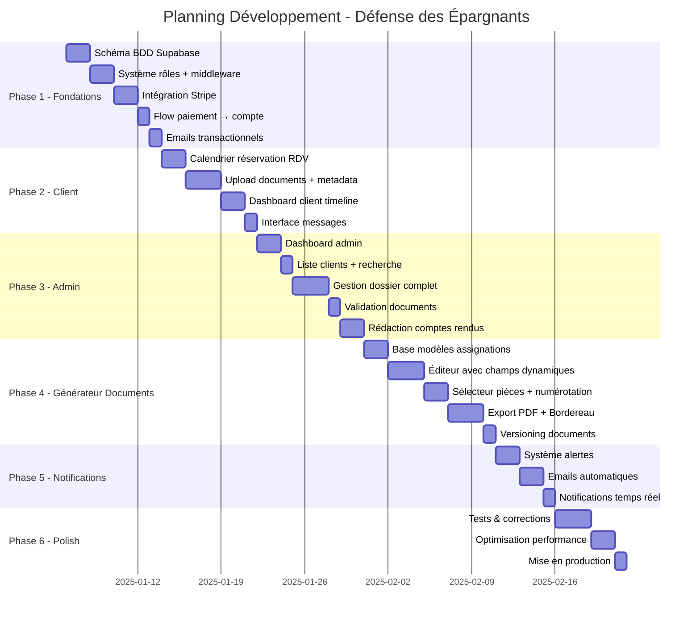

# 📋 Plan de Développement - Défense des Épargnants

## 🎯 Vision Produit

Plateforme permettant aux victimes de fraude bancaire d'accéder à une assistance juridique professionnelle à tarif accessible, grâce à l'automatisation par IA sous contrôle humain.

---

## 👥 Rôles Utilisateurs



### Matrice des Permissions

| Fonctionnalité | Client | Collaborateur | Avocat | Admin |
|----------------|:------:|:-------------:|:------:|:-----:|
| **ESPACE CLIENT** |
| Dashboard personnel | ✅ | 👁️ | 👁️ | 👁️ |
| Upload pièces | ✅ | ❌ | ❌ | ❌ |
| Prendre RDV | ✅ | ❌ | ❌ | ❌ |
| Lire comptes rendus | ✅ | ✅ | ✅ | ✅ |
| Messagerie | ✅ | ✅ | ✅ | ✅ |
| **ESPACE COLLABORATEUR** |
| Liste tous les clients | ❌ | ✅ | ✅ | ✅ |
| Mener entretiens | ❌ | ✅ | ✅ | ✅ |
| Remplir identité client | ❌ | ✅ | ✅ | ✅ |
| Remplir identité défendeur | ❌ | ✅ | ✅ | ✅ |
| Rédiger résumé faits | ❌ | ✅ | ✅ | ✅ |
| Mettre à jour statut | ❌ | ✅ | ✅ | ✅ |
| Valider pièces client | ❌ | ✅ | ✅ | ✅ |
| Calendrier global | ❌ | ✅ | ✅ | ✅ |
| **ESPACE AVOCAT** |
| Générer assignations | ❌ | ❌ | ✅ | ✅ |
| Rédiger comptes rendus | ❌ | ❌ | ✅ | ✅ |
| Valider docs juridiques | ❌ | ❌ | ✅ | ✅ |
| Utiliser modèles | ❌ | ❌ | ✅ | ✅ |
| **ESPACE ADMIN** |
| Gestion utilisateurs | ❌ | ❌ | ❌ | ✅ |
| Créer/modifier modèles | ❌ | ❌ | ❌ | ✅ |
| Paramètres système | ❌ | ❌ | ❌ | ✅ |
| Stats & exports globaux | ❌ | ❌ | ❌ | ✅ |

👁️ = Lecture seule sur les dossiers assignés

### Workflow Collaborateur Post-Entretien



---

## 🏗️ Architecture Globale



---

## 👥 Parcours Utilisateur Client



---

## 🔄 États du Dossier



---

## 🗄️ Modèle de Données



---

## 📄 Système de Génération d'Assignations

### Architecture du Générateur



### Types de Champs

| Type | Description | Exemple |
|------|-------------|---------|
| `auto` | Rempli depuis la BDD | Nom client, Banque, Montant préjudice |
| `fixed` | Texte juridique standard (modifiable) | Articles de loi, formules types |
| `free` | Zone de rédaction libre | Les faits, arguments spécifiques |
| `pieces` | Référence aux documents | "cf. Pièce n°3" |
| `date` | Date formatée juridiquement | "le quinze mars deux mille vingt-quatre" |
| `currency` | Montant formaté | "4 500,00 € (quatre mille cinq cents euros)" |

### Structure d'un Modèle

```
ASSIGNATION TYPE "FRAUDE CARTE BANCAIRE"
│
├── Section 1: EN-TÊTE
│   ├── [auto] Tribunal compétent
│   ├── [auto] Identité demandeur
│   └── [auto] Identité défendeur (banque)
│
├── Section 2: OBJET DE LA DEMANDE
│   └── [fixed] Texte standard + [auto] montant
│
├── Section 3: LES FAITS
│   └── [free] Rédaction avocat
│
├── Section 4: PIÈCES JUSTIFICATIVES
│   └── [pieces] Sélection + numérotation auto
│
├── Section 5: DISCUSSION JURIDIQUE
│   ├── [fixed] Articles L133-18 et suivants
│   ├── [fixed] Jurisprudence type
│   └── [free] Arguments spécifiques
│
└── Section 6: DEMANDES
    ├── [fixed] Formules de condamnation
    └── [auto] Montants calculés
```

### Workflow de Génération



### Export PDF - Structure

```
📁 Export_Assignation_DDE-2025-0042/
│
├── 📄 Assignation_DDE-2025-0042.pdf
│   └── Document principal formaté (en-tête tribunal, pagination)
│
├── 📄 Bordereau_pieces_DDE-2025-0042.pdf
│   └── Liste numérotée avec description et nb pages
│
└── 📁 Pieces/
    ├── 📄 Piece_01_Carte_identite.pdf
    ├── 📄 Piece_02_Releve_bancaire_mars_2024.pdf
    ├── 📄 Piece_03_Depot_plainte.pdf
    ├── 📄 Piece_04_Correspondance_banque.pdf
    └── ...
```

### Bordereau Auto-généré

```
┌──────────────────────────────────────────────────────────────────┐
│              BORDEREAU DE COMMUNICATION DE PIÈCES                │
│                                                                  │
│  Affaire: DUPONT c/ BNP PARIBAS                                 │
│  RG n°: [à compléter]                                           │
│  Dossier: DDE-2025-0042                                         │
│                                                                  │
├────────┬─────────────────────────────────────────┬──────────────┤
│ N°     │ Désignation                             │ Nb pages     │
├────────┼─────────────────────────────────────────┼──────────────┤
│ 1      │ Carte nationale d'identité              │ 1            │
│ 2      │ Relevé de compte mars 2024              │ 3            │
│ 3      │ Récépissé de dépôt de plainte           │ 2            │
│ 4      │ Échanges SMS avec le fraudeur           │ 4            │
│ 5      │ Courrier de réclamation à la banque     │ 1            │
│ 6      │ Réponse de la banque du 15/04/2024      │ 2            │
├────────┼─────────────────────────────────────────┼──────────────┤
│        │ TOTAL                                   │ 13 pages     │
└────────┴─────────────────────────────────────────┴──────────────┘
```

---

## 📁 Structure des Fichiers



---

## 🚀 Phases de Développement



---

## ✅ Checklist par Phase

### Phase 1 - Fondations (8 jours)
- [ ] Créer les tables Supabase (profiles, dossiers, documents, events, etc.)
- [ ] Configurer Row Level Security (RLS) pour chaque table
- [ ] Implémenter le middleware de protection des routes par rôle
- [ ] Configurer Stripe (produit, prix, webhook)
- [ ] Créer la page de paiement
- [ ] Implémenter le webhook Stripe (création compte post-paiement)
- [ ] Configurer Resend pour les emails transactionnels
- [ ] Email de bienvenue + validation

### Phase 2 - Espace Client (8 jours)
- [ ] Système de créneaux disponibles
- [ ] Interface de réservation RDV
- [ ] Confirmation + rappels email
- [ ] Upload de fichiers vers Supabase Storage
- [ ] Formulaire métadonnées documents
- [ ] Liste des documents avec statuts
- [ ] Dashboard avec timeline dossier
- [ ] Affichage comptes rendus publiés
- [ ] Interface de messagerie simple

### Phase 3 - Back-Office (9 jours)
- [ ] Dashboard admin avec KPIs
- [ ] Liste clients avec filtres et recherche
- [ ] Vue détaillée dossier client
- [ ] Interface validation/rejet documents
- [ ] Éditeur de comptes rendus (Markdown)
- [ ] Publication vers client
- [ ] Calendrier vue globale (tous les RDV)
- [ ] Modification statut dossier

### Phase 4 - Générateur de Documents (11 jours)
- [ ] Tables Supabase (document_templates, assignations, assignation_versions)
- [ ] Interface gestion des modèles d'assignation
- [ ] Éditeur de modèles avec sections et champs typés
- [ ] Éditeur d'assignation avec champs auto-remplis
- [ ] Zone de rédaction libre (faits) avec éditeur Markdown
- [ ] Sélecteur de pièces avec numérotation automatique
- [ ] Prévisualisation temps réel du document
- [ ] Export PDF formaté (Puppeteer ou react-pdf)
- [ ] Génération automatique du bordereau des pièces
- [ ] Compilation des pièces numérotées en annexe
- [ ] Export archive ZIP complète
- [ ] Historique des versions avec diff

### Phase 5 - Notifications (5 jours)
- [ ] Table des alertes
- [ ] Génération automatique d'alertes
- [ ] Centre de notifications admin
- [ ] Emails automatiques (rappels, mises à jour)
- [ ] Notifications temps réel (Supabase Realtime)

### Phase 6 - Finalisation (6 jours)
- [ ] Tests end-to-end parcours client complet
- [ ] Tests end-to-end parcours admin complet
- [ ] Tests génération documents PDF
- [ ] Correction bugs
- [ ] Optimisation images et assets
- [ ] Configuration production Vercel
- [ ] Domaine personnalisé + SSL
- [ ] Monitoring (Sentry ou similaire)

---

## 📊 KPIs à Suivre

| Métrique | Objectif Phase 1 |
|----------|------------------|
| Clients inscrits | 100 |
| Taux conversion landing → paiement | 5% |
| RDV planifiés | 80 |
| Documents uploadés | 500 |
| Dossiers en cours | 50 |

---

## 🔐 Sécurité

- **Authentification** : Supabase Auth (JWT)
- **Autorisation** : Row Level Security (RLS) + middleware Next.js
- **Paiement** : Stripe (PCI DSS compliant)
- **Stockage** : Supabase Storage (buckets privés)
- **Emails** : Resend (SPF/DKIM configurés)
- **HTTPS** : Vercel (automatique)
- **RGPD** : Consentement + droit à l'oubli à implémenter

---

## 🛠️ Stack Technique

| Composant | Technologie |
|-----------|-------------|
| Frontend | Next.js 16 + React 19 |
| Styling | Tailwind CSS + Shadcn/UI |
| Backend | Supabase (PostgreSQL + Auth + Storage) |
| Paiement | Stripe |
| Emails | Resend |
| Hébergement | Vercel |
| IA | OpenAI API (classification documents) |

