# 📋 Plan de Développement - Défense des Épargnants

> **Dernière mise à jour** : 21 décembre 2024

## 🎯 Vision Produit

Plateforme permettant aux victimes de fraude bancaire d'accéder à une assistance juridique professionnelle à tarif accessible, grâce à l'automatisation par IA sous contrôle humain.

---

## 📊 État Actuel du Projet

### ✅ Réalisé (Phase 1-2)

| Module | Statut | Description |
|--------|--------|-------------|
| **Landing Page** | ✅ Complet | Hero, Problem, Solution, Process, Pricing, FAQ, CTA |
| **Authentification** | ✅ Complet | Magic link, inscription, politique mot de passe fort |
| **Paiement Stripe** | ✅ Complet | Checkout 90€, création auto compte/dossier après paiement |
| **Calendrier Cal.com** | ✅ Complet | Réservation RDV après paiement |
| **Dashboard Client** | ✅ Complet | Redirection vers /dossier, données Supabase réelles |
| **Page Dossier** | ✅ Complet | Victimes multiples, infos banque, description éditable, type contentieux |
| **Upload Documents** | ✅ Complet | Supabase Storage, métadonnées, suppression |
| **Notifications** | ✅ Complet | Bell icon, page notifications, système d'alertes |
| **Sécurité** | ✅ Complet | 2FA prêt, audit logs, password policy |
| **Procédure Dossier** | ✅ Complet | Timeline étapes légales, échéances, comptes-rendus, pièces |

### 🚧 En cours

| Module | Statut | Description |
|--------|--------|-------------|
| **Back-office Avocat** | 🚧 À faire | Interface de gestion des dossiers côté avocat |

### ⏳ À venir

- Génération de documents (assignations, bordereaux)
- Signature électronique convention d'honoraires
- Messagerie temps réel
- Marketing & SEO
- Centre de données / Observatoire

---

## 👥 Rôles Utilisateurs

```mermaid
flowchart TB
    subgraph ROLES["4 Niveaux d'Accès"]
        CLIENT["👤 CLIENT<br/>Victime de fraude"]
        COLLAB["👥 COLLABORATEUR<br/>Assistant juridique"]
        AVOCAT["⚖️ AVOCAT<br/>Me. Majster"]
        ADMIN["🔐 ADMIN<br/>Super administrateur"]
    end

    subgraph PERM_CLIENT["Espace Client"]
        C1[Dashboard personnel]
        C2[Upload pièces]
        C3[Prise de RDV]
        C4[Lecture comptes rendus]
        C5[Messagerie]
    end

    subgraph PERM_COLLAB["Espace Collaborateur"]
        CO1[Liste clients]
        CO2[Mener entretiens]
        CO3[Remplir identités]
        CO4[Résumé des faits]
        CO5[MAJ statut dossier]
        CO6[Valider pièces]
        CO7[Calendrier global]
    end

    subgraph PERM_AVOCAT["Espace Avocat"]
        A1[Tout Collaborateur +]
        A2[Générer assignations]
        A3[Comptes rendus]
        A4[Valider docs juridiques]
        A5[Modèles documents]
    end

    subgraph PERM_ADMIN["Espace Admin"]
        AD1[Tout Avocat +]
        AD2[Gestion utilisateurs]
        AD3[Créer modèles]
        AD4[Paramètres système]
        AD5[Statistiques]
    end

    CLIENT --> PERM_CLIENT
    COLLAB --> PERM_COLLAB
    AVOCAT --> PERM_AVOCAT
    ADMIN --> PERM_ADMIN
    
    PERM_COLLAB -.->|inclut| PERM_CLIENT
    PERM_AVOCAT -.->|inclut| PERM_COLLAB
    PERM_ADMIN -.->|inclut| PERM_AVOCAT
```



### Matrice des Permissions

| Fonctionnalité | Client | Collaborateur | Avocat | Admin |
|----------------|:------:|:-------------:|:------:|:-----:|
| **ESPACE CLIENT** |
| Dashboard personnel | ✅ | 👁️ | 👁️ | 👁️ |
| Upload pièces | ✅ | ❌ | ❌ | ❌ |
| Prendre RDV | ✅ | ❌ | ❌ | ❌ |
| Lire comptes rendus | ✅ | ✅ | ✅ | ✅ |
| Messagerie | ✅ | ✅ | ✅ | ✅ |
| **ESPACE COLLABORATEUR** |
| Liste tous les clients | ❌ | ✅ | ✅ | ✅ |
| Mener entretiens | ❌ | ✅ | ✅ | ✅ |
| Remplir identité client | ❌ | ✅ | ✅ | ✅ |
| Remplir identité défendeur | ❌ | ✅ | ✅ | ✅ |
| Rédiger résumé faits | ❌ | ✅ | ✅ | ✅ |
| Mettre à jour statut | ❌ | ✅ | ✅ | ✅ |
| Valider pièces client | ❌ | ✅ | ✅ | ✅ |
| Calendrier global | ❌ | ✅ | ✅ | ✅ |
| **ESPACE AVOCAT** |
| Générer assignations | ❌ | ❌ | ✅ | ✅ |
| Rédiger comptes rendus | ❌ | ❌ | ✅ | ✅ |
| Valider docs juridiques | ❌ | ❌ | ✅ | ✅ |
| Utiliser modèles | ❌ | ❌ | ✅ | ✅ |
| **ESPACE ADMIN** |
| Gestion utilisateurs | ❌ | ❌ | ❌ | ✅ |
| Créer/modifier modèles | ❌ | ❌ | ❌ | ✅ |
| Paramètres système | ❌ | ❌ | ❌ | ✅ |
| Stats & exports globaux | ❌ | ❌ | ❌ | ✅ |

👁️ = Lecture seule sur les dossiers assignés

### Workflow Collaborateur Post-Entretien

```mermaid
sequenceDiagram
    participant C as Client
    participant CO as Collaborateur
    participant SYS as Système
    participant AV as Avocat

    C->>SYS: Paiement entretien initial
    SYS->>C: Email confirmation + création compte
    C->>SYS: Réservation créneau RDV
    
    rect rgb(240, 248, 255)
        Note over CO,C: Entretien 45 min
        CO->>C: Conduit l'entretien
        CO->>SYS: Remplit identité client
        CO->>SYS: Remplit identité défendeur (banque)
        CO->>SYS: Rédige résumé des faits
        CO->>SYS: Met à jour statut → "RDV effectué"
    end
    
    SYS->>C: Notification: RDV effectué
    SYS->>AV: Alerte: Nouveau dossier à traiter
    
    AV->>SYS: Génère convention d'honoraires
    SYS->>C: Email: Convention à signer
    
    C->>SYS: Upload pièces justificatives
    CO->>SYS: Valide les pièces
    SYS->>C: Notification: Pièces validées
```



---

## 🏗️ Architecture Globale

```mermaid
flowchart TB
    subgraph PUBLIC["🌐 Site Public"]
        LP[Landing Page]
        PRICING[Tarifs]
        FAQ[FAQ]
    end

    subgraph AUTH["🔐 Authentification"]
        PAY[Paiement Stripe]
        SIGNUP[Création Compte]
        VERIFY[Validation Email]
        LOGIN[Connexion]
    end

    subgraph CLIENT["👤 Espace Client"]
        CDASH[Dashboard]
        CPIECES[Mes Pièces]
        CCAL[Calendrier RDV]
        CREPORTS[Comptes Rendus]
        CMSG[Messages]
    end

    subgraph COLLAB["👥 Espace Collaborateur"]
        CODASH[Dashboard Collab]
        COENTRETIEN[Formulaire Entretien]
        COVALIDATE[Validation Pièces]
        COSTATUS[MAJ Statuts]
    end

    subgraph AVOCAT["⚖️ Espace Avocat"]
        AVDASH[Dashboard Avocat]
        AVASSIGN[Générateur Assignations]
        AVREPORTS[Comptes Rendus]
        AVMODELES[Modèles Documents]
    end

    subgraph ADMIN["🔐 Espace Admin"]
        ADASH[Dashboard Admin]
        AUSERS[Gestion Utilisateurs]
        ASTATS[Statistiques]
        ASETTINGS[Paramètres]
    end

    subgraph INFRA["☁️ Infrastructure"]
        SUPA[(Supabase)]
        STRIPE[Stripe]
        EMAIL[Resend/SendGrid]
        STORAGE[Supabase Storage]
    end

    LP -->|CTA| PAY
    PAY -->|Succès| SIGNUP
    SIGNUP -->|Email| VERIFY
    VERIFY -->|Validé| LOGIN
    LOGIN -->|Client| CDASH
    LOGIN -->|Collaborateur| CODASH
    LOGIN -->|Avocat| AVDASH
    LOGIN -->|Admin| ADASH

    CDASH --> CPIECES
    CDASH --> CCAL
    CDASH --> CREPORTS
    CDASH --> CMSG

    CODASH --> COENTRETIEN
    CODASH --> COVALIDATE
    CODASH --> COSTATUS

    AVDASH --> AVASSIGN
    AVDASH --> AVREPORTS
    AVDASH --> AVMODELES

    ADASH --> AUSERS
    ADASH --> ASTATS
    ADASH --> ASETTINGS

    CLIENT <-->|API| SUPA
    ADMIN <-->|API| SUPA
    PAY <-->|Webhook| STRIPE
    AUTH -->|Transactionnel| EMAIL
    CPIECES -->|Upload| STORAGE
```



---

## 👥 Parcours Utilisateur Client


---

## 🔄 États du Dossier

```mermaid
stateDiagram-v2
    [*] --> paiement_pending: Nouveau client

    paiement_pending --> rdv_pending: Paiement validé
    rdv_pending --> rdv_scheduled: RDV réservé
    rdv_scheduled --> convention_pending: RDV effectué
    
    convention_pending --> convention_signed: Convention signée
    convention_signed --> pieces_pending: En attente pièces
    
    pieces_pending --> mise_en_demeure: Pièces validées
    mise_en_demeure --> attente_reponse: MED envoyée
    
    attente_reponse --> clos_gagne: Banque accepte
    attente_reponse --> assignation: Banque refuse/silence
    
    assignation --> audience_scheduled: Assignation délivrée
    audience_scheduled --> jugement_pending: Audience tenue
    
    jugement_pending --> clos_gagne: Jugement favorable
    jugement_pending --> clos_perdu: Jugement défavorable
    
    pieces_pending --> clos_abandon: Client abandonne
    convention_pending --> clos_abandon: Client abandonne

    clos_gagne --> [*]
    clos_perdu --> [*]
    clos_abandon --> [*]
```



---

## 🗄️ Modèle de Données


---

## 📄 Système de Génération d'Assignations

### Architecture du Générateur


### Types de Champs

| Type | Description | Exemple |
|------|-------------|---------|
| `auto` | Rempli depuis la BDD | Nom client, Banque, Montant préjudice |
| `fixed` | Texte juridique standard (modifiable) | Articles de loi, formules types |
| `free` | Zone de rédaction libre | Les faits, arguments spécifiques |
| `pieces` | Référence aux documents | "cf. Pièce n°3" |
| `date` | Date formatée juridiquement | "le quinze mars deux mille vingt-quatre" |
| `currency` | Montant formaté | "4 500,00 € (quatre mille cinq cents euros)" |

### Structure d'un Modèle

```
ASSIGNATION TYPE "FRAUDE CARTE BANCAIRE"
│
├── Section 1: EN-TÊTE
│   ├── [auto] Tribunal compétent
│   ├── [auto] Identité demandeur
│   └── [auto] Identité défendeur (banque)
│
├── Section 2: OBJET DE LA DEMANDE
│   └── [fixed] Texte standard + [auto] montant
│
├── Section 3: LES FAITS
│   └── [free] Rédaction avocat
│
├── Section 4: PIÈCES JUSTIFICATIVES
│   └── [pieces] Sélection + numérotation auto
│
├── Section 5: DISCUSSION JURIDIQUE
│   ├── [fixed] Articles L133-18 et suivants
│   ├── [fixed] Jurisprudence type
│   └── [free] Arguments spécifiques
│
└── Section 6: DEMANDES
    ├── [fixed] Formules de condamnation
    └── [auto] Montants calculés
```

### Workflow de Génération


### Export PDF - Structure

```
📁 Export_Assignation_DDE-2025-0042/
│
├── 📄 Assignation_DDE-2025-0042.pdf
│   └── Document principal formaté (en-tête tribunal, pagination)
│
├── 📄 Bordereau_pieces_DDE-2025-0042.pdf
│   └── Liste numérotée avec description et nb pages
│
└── 📁 Pieces/
    ├── 📄 Piece_01_Carte_identite.pdf
    ├── 📄 Piece_02_Releve_bancaire_mars_2024.pdf
    ├── 📄 Piece_03_Depot_plainte.pdf
    ├── 📄 Piece_04_Correspondance_banque.pdf
    └── ...
```

### Bordereau Auto-généré

```
┌──────────────────────────────────────────────────────────────────┐
│              BORDEREAU DE COMMUNICATION DE PIÈCES                │
│                                                                  │
│  Affaire: DUPONT c/ BNP PARIBAS                                 │
│  RG n°: [à compléter]                                           │
│  Dossier: DDE-2025-0042                                         │
│                                                                  │
├────────┬─────────────────────────────────────────┬──────────────┤
│ N°     │ Désignation                             │ Nb pages     │
├────────┼─────────────────────────────────────────┼──────────────┤
│ 1      │ Carte nationale d'identité              │ 1            │
│ 2      │ Relevé de compte mars 2024              │ 3            │
│ 3      │ Récépissé de dépôt de plainte           │ 2            │
│ 4      │ Échanges SMS avec le fraudeur           │ 4            │
│ 5      │ Courrier de réclamation à la banque     │ 1            │
│ 6      │ Réponse de la banque du 15/04/2024      │ 2            │
├────────┼─────────────────────────────────────────┼──────────────┤
│        │ TOTAL                                   │ 13 pages     │
└────────┴─────────────────────────────────────────┴──────────────┘
```

---

## 📁 Structure des Fichiers


---

## 📊 Centre de Données & Observatoire des Fraudes

### Architecture Data

```mermaid
flowchart TB
    subgraph COLLECTE["📥 Collecte de Données"]
        DOSSIERS_DATA[Données Dossiers]
        BANQUES_DATA[Données Banques]
        FRAUDES_DATA[Types de Fraudes]
        PARCOURS_DATA[Parcours Clients]
        OUTCOMES_DATA[Issues Procédures]
    end

    subgraph TRAITEMENT["⚙️ Traitement & Enrichissement"]
        CLEAN[Nettoyage & Normalisation]
        ANON[Anonymisation RGPD]
        ENRICH[Enrichissement IA]
        CATEGORIZE[Catégorisation auto]
    end

    subgraph ANALYTICS["📈 Analytics & Insights"]
        DASHBOARD_DATA[Tableaux de bord]
        TRENDS[Tendances & Patterns]
        PREDICT[Prédictions]
        ALERTS_DATA[Alertes anomalies]
    end

    subgraph OUTPUTS["📤 Valorisation"]
        REPORTS_PUB[Rapports publics]
        PRESS[Données presse]
        ADVOCACY[Plaidoyer institutionnel]
        RESEARCH[Recherche académique]
        INTERNAL[Amélioration services]
    end

    COLLECTE --> TRAITEMENT
    TRAITEMENT --> ANALYTICS
    ANALYTICS --> OUTPUTS
```



### Objectifs de l'Observatoire

| Objectif | Description |
|----------|-------------|
| **Comprendre** | Cartographier les fraudes bancaires en France |
| **Quantifier** | Mesurer l'ampleur du phénomène par banque/type |
| **Identifier** | Détecter les banques les plus problématiques |
| **Prédire** | Anticiper les tendances et nouveaux types de fraudes |
| **Alerter** | Signaler les pics d'activité frauduleuse |
| **Plaider** | Fournir des données pour faire évoluer la législation |
| **Communiquer** | Alimenter la presse avec des statistiques fiables |

### Taxonomie des Fraudes

```
📁 Types de Fraudes
│
├── 💳 Fraude Carte Bancaire
│   ├── Paiement à distance frauduleux
│   ├── Contrefaçon de carte
│   ├── Vol et utilisation
│   └── Skimming
│
├── 📞 Fraude au Faux Conseiller
│   ├── Appel téléphonique
│   ├── SMS avec lien
│   └── Email de phishing
│
├── 💻 Fraude en Ligne
│   ├── Phishing bancaire
│   ├── Malware/Keylogger
│   ├── SIM Swap
│   └── Compromission email
│
├── 📄 Fraude Documentaire
│   ├── Fausse identité
│   ├── Faux RIB
│   └── Usurpation
│
└── 🏦 Autres
    ├── Virement frauduleux
    ├── Prélèvement non autorisé
    └── Escroquerie placement
```

### Modèle de Données Analytics

```mermaid
erDiagram
    CLIENT_ANALYTICS {
        uuid id PK
        uuid dossier_id FK
        string tranche_age
        string departement
        string categorie_socio_pro
        boolean premiere_fraude
        string canal_decouverte
    }

    FRAUDE_ANALYTICS {
        uuid id PK
        uuid dossier_id FK
        string type_fraude
        string mode_operatoire
        string canal_fraude
        date date_fraude
        decimal montant_initial
        string banque_code
    }

    BANQUE_RESPONSE_ANALYTICS {
        uuid id PK
        uuid dossier_id FK
        string banque_code
        integer delai_reponse_jours
        boolean remboursement_propose
        string motif_refus_principal
    }

    PROCEDURE_ANALYTICS {
        uuid id PK
        uuid dossier_id FK
        string issue
        decimal montant_recupere
        integer duree_totale_jours
        array arguments_gagnants
        array jurisprudence_citee
    }

    BANQUE_SCORES {
        uuid id PK
        string banque_code
        string periode
        integer nombre_dossiers
        decimal taux_refus
        decimal taux_succes_judiciaire
        decimal score_global
        integer classement
    }

    FRAUD_TRENDS {
        uuid id PK
        string type_trend
        string severity
        string title
        string type_fraude
        string region
        decimal variation_pourcentage
    }

    CLIENT_ANALYTICS ||--|| FRAUDE_ANALYTICS : "subit"
    FRAUDE_ANALYTICS ||--|| BANQUE_RESPONSE_ANALYTICS : "reçoit"
    FRAUDE_ANALYTICS ||--|| PROCEDURE_ANALYTICS : "aboutit"
```



### Dashboard Analytique

```
┌─────────────────────────────────────────────────────────────────────────────┐
│  📊 Observatoire des Fraudes Bancaires                    [Export 📥] [2024]│
├─────────────────────────────────────────────────────────────────────────────┤
│                                                                             │
│  ┌─ VUE GLOBALE ──────────────────────────────────────────────────────────┐│
│  │  📁 Dossiers    │  💰 Préjudice total  │  ✅ Taux succès  │  ⏱️ Durée   ││
│  │     847        │     3.2 M€          │     76%         │   4.2 mois   ││
│  └─────────────────────────────────────────────────────────────────────────┘│
│                                                                             │
│  ┌─ RÉPARTITION PAR TYPE DE FRAUDE ───────────────────────────────────────┐│
│  │  ████████████████████░░░░░  Faux conseiller     45%  (381 dossiers)    ││
│  │  ██████████░░░░░░░░░░░░░░░  Fraude CB           28%  (237 dossiers)    ││
│  │  ██████░░░░░░░░░░░░░░░░░░░  Phishing            18%  (152 dossiers)    ││
│  │  ███░░░░░░░░░░░░░░░░░░░░░░  Autres               9%  (77 dossiers)     ││
│  └─────────────────────────────────────────────────────────────────────────┘│
│                                                                             │
│  ┌─ CLASSEMENT BANQUES (par nb de litiges) ───────────────────────────────┐│
│  │  Banque              │ Dossiers │ Préjudice moy │ Taux refus │ Score   ││
│  │  🔴 BNP Paribas      │   156    │   4 200 €    │    82%     │  2.1/5  ││
│  │  🔴 Société Générale │   134    │   3 800 €    │    78%     │  2.3/5  ││
│  │  🟠 Crédit Agricole  │   98     │   3 500 €    │    65%     │  2.8/5  ││
│  │  🟡 Boursorama       │   72     │   2 900 €    │    45%     │  3.4/5  ││
│  └─────────────────────────────────────────────────────────────────────────┘│
│                                                                             │
│  ┌─ INSIGHTS IA ──────────────────────────────────────────────────────────┐│
│  │ 💡 Pic de fraudes "faux conseiller" en IDF (+34% vs N-1)               ││
│  │ ⚠️ BNP: délai moyen de réponse passé de 15 à 28 jours                  ││
│  │ 📈 Montant moyen en hausse: 3 200€ → 4 100€ (+28%)                     ││
│  │ ✅ Jurisprudence Cass. 2024 citée dans 89% des victoires               ││
│  └─────────────────────────────────────────────────────────────────────────┘│
└─────────────────────────────────────────────────────────────────────────────┘
```

### Rapports Générables

| Rapport | Destinataire | Fréquence |
|---------|--------------|-----------|
| **Rapport Annuel** | Grand public, Presse | Annuel |
| **Fiches Banques** | Clients, Prospects | Trimestriel |
| **Alertes Tendances** | Équipe interne | Temps réel |
| **Données Presse** | Journalistes | Sur demande |
| **Plaidoyer AMF** | Régulateur | Annuel |
| **Datasets Recherche** | Universitaires | Sur demande |

### Conformité RGPD

```mermaid
flowchart LR
    subgraph RAW["Données Brutes"]
        PERSONAL[Données personnelles<br/>Nom, Email, Adresse]
    end

    subgraph PROCESS["Traitement"]
        ANON_PROCESS[Anonymisation]
        AGG[Agrégation]
    end

    subgraph ANALYTICS_STORE["Données Analytics"]
        ANON_DATA[Données anonymisées<br/>Tranche âge, Département]
        STATS[Statistiques agrégées]
    end

    RAW -->|Suppression identifiants| PROCESS
    PROCESS --> ANALYTICS_STORE
```



| Principe RGPD | Application |
|---------------|-------------|
| **Minimisation** | Seules les données nécessaires à l'analyse |
| **Anonymisation** | Pas de nom, email, adresse exacte |
| **Agrégation** | Tranches d'âge, départements uniquement |
| **Consentement** | Case "Participer à l'observatoire" |
| **Opposition** | Retrait possible des données analytics |

---

## 🚀 Phases de Développement

```mermaid
gantt
    title Planning Développement - Défense des Épargnants
    dateFormat  YYYY-MM-DD
    
    section Phase 1 - Fondations
    Schéma BDD Supabase           :p1a, 2025-01-06, 2d
    Système rôles + middleware    :p1b, after p1a, 2d
    Intégration Stripe            :p1c, after p1b, 2d
    Flow paiement → compte        :p1d, after p1c, 1d
    Emails transactionnels        :p1e, after p1d, 1d
    
    section Phase 2 - Client
    Calendrier réservation RDV    :p2a, after p1e, 2d
    Upload documents + metadata   :p2b, after p2a, 3d
    Dashboard client timeline     :p2c, after p2b, 2d
    Interface messages            :p2d, after p2c, 1d
    
    section Phase 3 - Admin
    Dashboard admin               :p3a, after p2d, 2d
    Liste clients + recherche     :p3b, after p3a, 1d
    Gestion dossier complet       :p3c, after p3b, 3d
    Validation documents          :p3d, after p3c, 1d
    Rédaction comptes rendus      :p3e, after p3d, 2d
    
    section Phase 4 - Générateur Documents
    Base modèles assignations     :p4a, after p3e, 2d
    Éditeur avec champs dynamiques:p4b, after p4a, 3d
    Sélecteur pièces + numérotation:p4c, after p4b, 2d
    Export PDF + Bordereau        :p4d, after p4c, 3d
    Versioning documents          :p4e, after p4d, 1d
    
    section Phase 5 - Notifications
    Système alertes               :p5a, after p4e, 2d
    Emails automatiques           :p5b, after p5a, 2d
    Notifications temps réel      :p5c, after p5b, 1d
    
    section Phase 6 - Marketing
    Intégration Google Ads API    :p6a, after p5c, 3d
    Dashboard marketing           :p6b, after p6a, 2d
    Module SEO + Blog             :p6c, after p6b, 3d
    Tracking conversions          :p6d, after p6c, 2d

    section Phase 7 - Centre de Données
    Tables analytics              :p7a, after p6d, 2d
    Collecte et anonymisation     :p7b, after p7a, 2d
    Dashboard observatoire        :p7c, after p7b, 3d
    Générateur rapports           :p7d, after p7c, 2d
    Alertes tendances IA          :p7e, after p7d, 2d
    
    section Phase 8 - Polish
    Tests & corrections           :p8a, after p7e, 3d
    Optimisation performance      :p8b, after p8a, 2d
    Mise en production            :p8c, after p8b, 1d
```



---

## ✅ Checklist par Phase

### Phase 1 - Fondations (8 jours) ✅ TERMINÉ
- [x] Créer les tables Supabase (profiles, dossiers, documents, events, etc.)
- [x] Configurer Row Level Security (RLS) pour chaque table
- [x] Implémenter le middleware de protection des routes par rôle
- [x] Configurer Stripe (produit, prix, webhook)
- [x] Créer la page de paiement
- [x] Implémenter le webhook Stripe (création compte post-paiement)
- [ ] Configurer Resend pour les emails transactionnels
- [ ] Email de bienvenue + validation

### Phase 2 - Espace Client (8 jours) ✅ TERMINÉ
- [x] Système de créneaux disponibles (Cal.com)
- [x] Interface de réservation RDV
- [x] Confirmation + rappels email (via Cal.com)
- [x] Upload de fichiers vers Supabase Storage
- [x] Formulaire métadonnées documents
- [x] Liste des documents avec statuts
- [x] Dashboard avec timeline dossier
- [x] Affichage comptes rendus publiés (structure prête)
- [ ] Interface de messagerie simple

### Phase 3 - Back-Office (9 jours)
- [ ] Dashboard admin avec KPIs
- [ ] Liste clients avec filtres et recherche
- [ ] Vue détaillée dossier client
- [ ] Interface validation/rejet documents
- [ ] Éditeur de comptes rendus (Markdown)
- [ ] Publication vers client
- [ ] Calendrier vue globale (tous les RDV)
- [ ] Modification statut dossier

### Phase 4 - Générateur de Documents (11 jours)
- [ ] Tables Supabase (document_templates, assignations, assignation_versions)
- [ ] Interface gestion des modèles d'assignation
- [ ] Éditeur de modèles avec sections et champs typés
- [ ] Éditeur d'assignation avec champs auto-remplis
- [ ] Zone de rédaction libre (faits) avec éditeur Markdown
- [ ] Sélecteur de pièces avec numérotation automatique
- [ ] Prévisualisation temps réel du document
- [ ] Export PDF formaté (Puppeteer ou react-pdf)
- [ ] Génération automatique du bordereau des pièces
- [ ] Compilation des pièces numérotées en annexe
- [ ] Export archive ZIP complète
- [ ] Historique des versions avec diff

### Phase 5 - Notifications (5 jours)
- [ ] Table des alertes
- [ ] Génération automatique d'alertes
- [ ] Centre de notifications admin
- [ ] Emails automatiques (rappels, mises à jour)
- [ ] Notifications temps réel (Supabase Realtime)

### Phase 6 - Marketing & Acquisition (10 jours)
- [ ] Intégration Google Ads API
- [ ] Dashboard gestion campagnes
- [ ] Tracking conversions (gclid, UTM)
- [ ] Module blog/articles SEO
- [ ] Gestion meta tags dynamiques
- [ ] Intégration Google Search Console
- [ ] Rapports ROI par canal

### Phase 7 - Centre de Données (11 jours)
- [ ] Tables analytics (client, fraude, banque, procédure)
- [ ] Pipeline anonymisation RGPD
- [ ] Dashboard observatoire des fraudes
- [ ] Classement et scoring banques
- [ ] Générateur rapports (annuel, fiches banques)
- [ ] Système alertes tendances
- [ ] Export datasets anonymisés
- [ ] Consentement et droit d'opposition

### Phase 8 - Finalisation (6 jours)
- [ ] Tests end-to-end parcours client complet
- [ ] Tests end-to-end parcours admin complet
- [ ] Tests génération documents PDF
- [ ] Correction bugs
- [ ] Optimisation images et assets
- [ ] Configuration production Vercel
- [ ] Domaine personnalisé + SSL
- [ ] Monitoring (Sentry ou similaire)

---

## 📊 KPIs à Suivre

| Métrique | Objectif Phase 1 |
|----------|------------------|
| Clients inscrits | 100 |
| Taux conversion landing → paiement | 5% |
| RDV planifiés | 80 |
| Documents uploadés | 500 |
| Dossiers en cours | 50 |

---

## 🔐 Sécurité

- **Authentification** : Supabase Auth (JWT)
- **Autorisation** : Row Level Security (RLS) + middleware Next.js
- **Paiement** : Stripe (PCI DSS compliant)
- **Stockage** : Supabase Storage (buckets privés)
- **Emails** : Resend (SPF/DKIM configurés)
- **HTTPS** : Vercel (automatique)
- **RGPD** : Consentement + droit à l'oubli à implémenter

---

## 🛠️ Stack Technique

| Composant | Technologie |
|-----------|-------------|
| Frontend | Next.js 16 + React 19 |
| Styling | Tailwind CSS + Shadcn/UI |
| Backend | Supabase (PostgreSQL + Auth + Storage) |
| Paiement | Stripe |
| Emails | Resend |
| Hébergement | Vercel |
| IA | OpenAI API (classification documents) |

