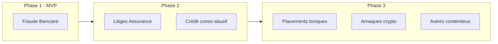
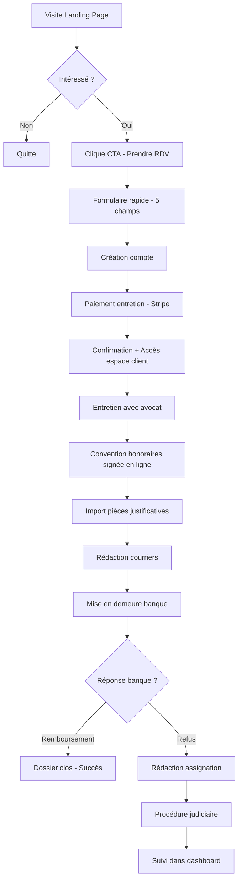
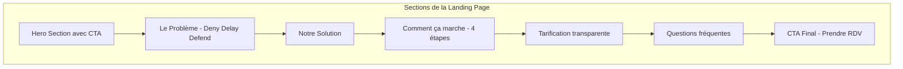
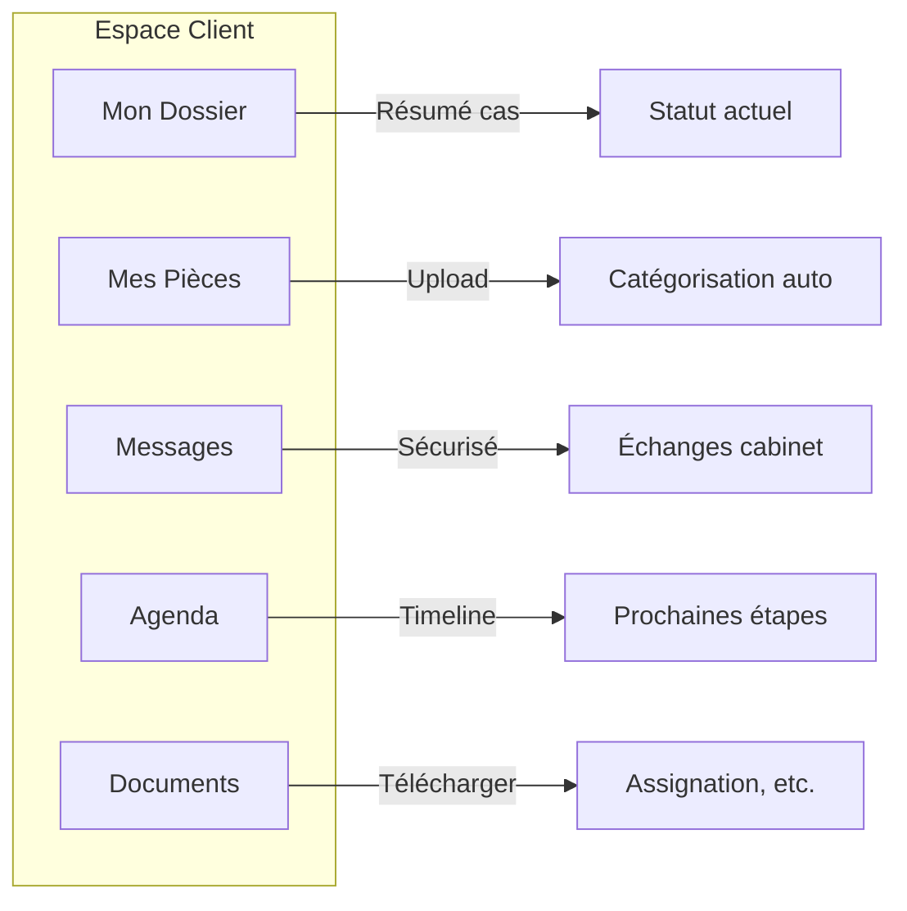
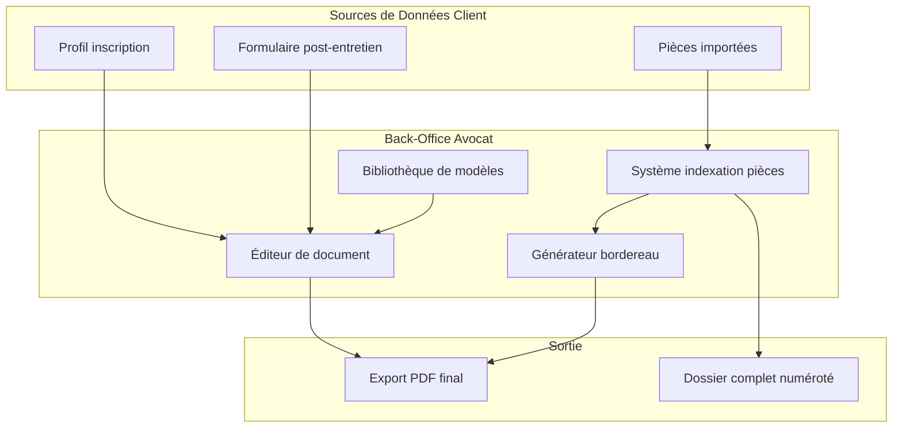
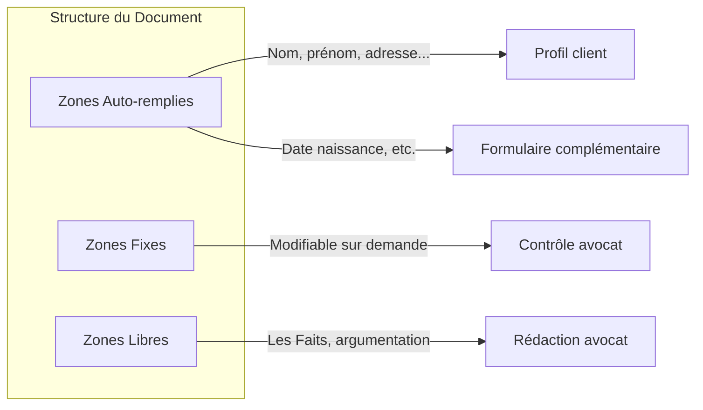
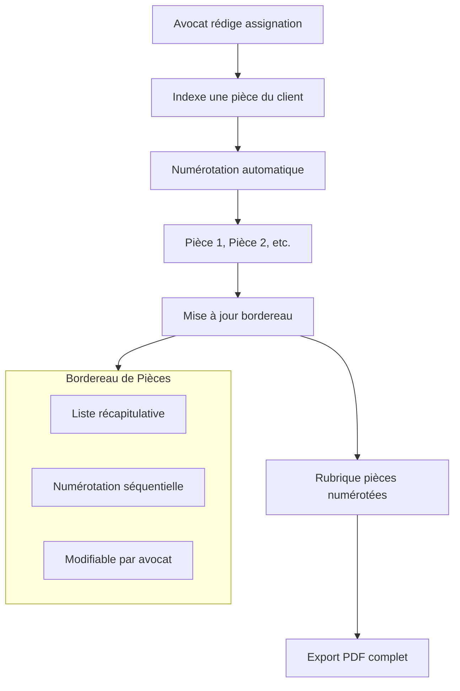
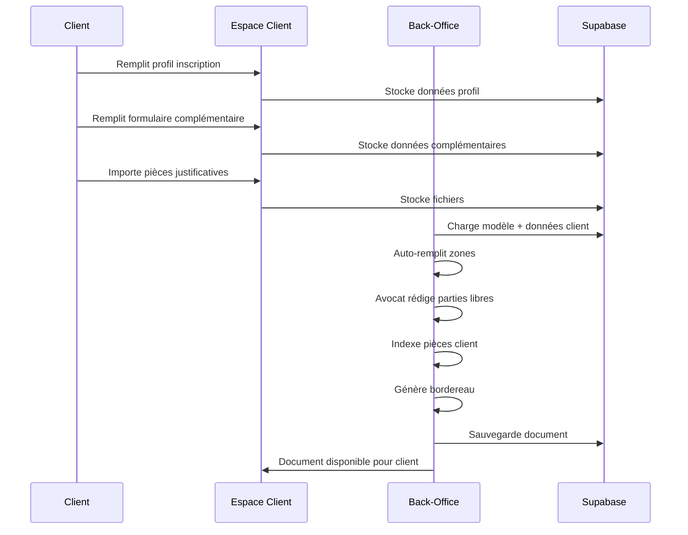
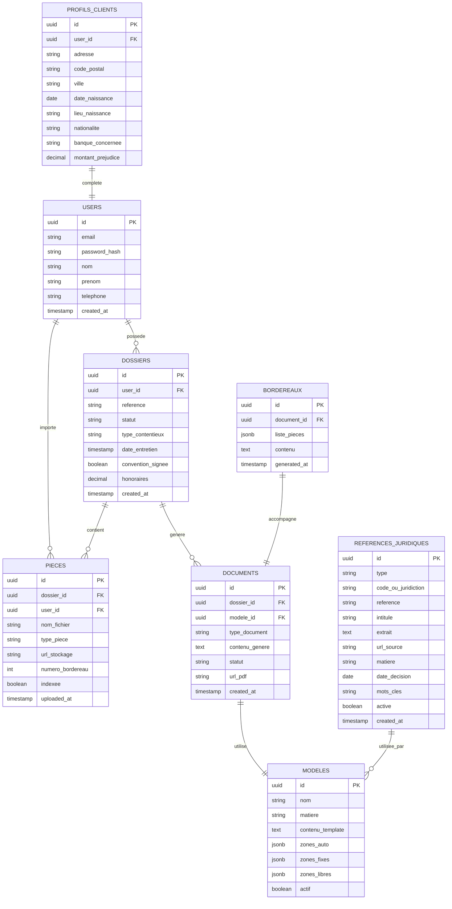
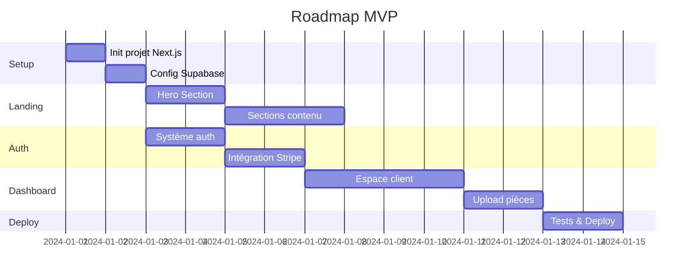

# 🏛️ Plateforme de Défense des Épargnants

> **Rétablir le rapport de force face aux institutions financières**

## 📋 Vision du Projet

### Mission

Permettre aux particuliers floués par les institutions bancaires, assurantielles ou financières d'accéder à une **justice de qualité à un coût compatible avec leur préjudice**.

Face aux grandes institutions qui utilisent la technique **"Deny, Delay, Defend"** (nier, retarder, défendre), les clients sont souvent démunis. Le coût d'une procédure judiciaire dépasse fréquemment l'enjeu financier, décourageant toute action.

### Notre Approche

Grâce à l'**automatisation intelligente** (classification de pièces, génération de documents juridiques), nous réduisons drastiquement le coût de traitement des dossiers, rendant ces procédures économiquement viables.

### Roadmap Multi-Contentieux



| Phase | Contentieux | Cible |
|-------|-------------|-------|
| **Phase 1** | Fraude bancaire (faux conseiller) | Victimes de spoofing, phishing |
| **Phase 2** | Assurances, crédits abusifs | Clients lésés par refus de garantie |
| **Phase 3** | Investissements, crypto | Victimes de placements toxiques |

---

## 🎯 Phase 1 : Fraude Bancaire

### Le Problème Spécifique

Les banques utilisent la technique **"Deny, Delay, Defend"** face aux victimes de fraude :
- Refus systématique de remboursement
- Accusation de négligence du client
- Procédures longues et coûteuses qui découragent les victimes

### Notre Solution

- Process automatisé = coûts réduits de 40%
- Expertise d'un ancien magistrat
- Plateforme ergonomique pour le suivi de dossier

---

## 🏗️ Architecture Technique

### Stack Technologique

| Composant | Technologie | Justification |
|-----------|-------------|---------------|
| Framework | **Next.js 14** (App Router) | SEO natif, performance, Server Components |
| UI Library | **Tailwind CSS + shadcn/ui** | Design moderne, composants accessibles |
| Base de données | **Supabase** (PostgreSQL) | Auth intégrée, stockage fichiers, temps réel |
| Paiement | **Stripe** | Fiable, conforme RGPD |
| Hébergement | **Vercel** | Déploiement automatique, CDN global |

### Structure du Projet

```
corentin-app/
├── app/
│   ├── (marketing)/        # Landing page, pages publiques
│   ├── (auth)/             # Connexion, inscription
│   ├── (client)/           # Espace client protégé
│   └── (avocat)/           # Back-office avocat (Phase 2)
├── components/
│   ├── ui/                 # Composants shadcn/ui
│   ├── landing/            # Composants landing page
│   └── dashboard/          # Composants espace client
├── lib/
│   ├── supabase/           # Client et helpers Supabase
│   ├── stripe/             # Intégration paiement
│   └── utils/              # Utilitaires
└── public/
    └── assets/             # Images, icônes
```

---

## 🔄 Parcours Utilisateur



---

## 📄 Structure Landing Page



### Message Commercial

**Accroche principale (Hero):**
> "Victime de fraude bancaire ? Votre banque refuse de rembourser ? **Nous les assignons.**"

**Sous-accroche:**
> "Cabinet spécialisé dans la défense des victimes de fraudes au faux conseiller. Tarifs maîtrisés grâce à notre process optimisé."

**Les 3 piliers:**
1. **Expertise** - Ancien magistrat, spécialiste du contentieux bancaire
2. **Efficacité** - Process automatisé = coûts réduits de 40%
3. **Combativité** - 85% de succès sur les dossiers acceptés

---

## 🎨 Design System

### Palette de Couleurs

| Élément | Couleur | Code | Usage |
|---------|---------|------|-------|
| Primaire | Bleu marine | `#1e3a5f` | Confiance, sérieux juridique |
| Accent | Or/Bronze | `#c9a227` | Prestige, victoire |
| Danger | Rouge bordeaux | `#8b0000` | Urgence, alertes banques |
| Fond | Blanc cassé | `#fafaf9` | Lisibilité |
| Texte | Gris anthracite | `#1f2937` | Lecture confortable |

### Typographie

- **Titres:** Playfair Display (serif élégant, autorité)
- **Corps:** Source Sans Pro (lisibilité, moderne)

---

## 👤 Espace Client (Dashboard)

### Fonctionnalités MVP



### Catégories de Pièces

- 📄 Relevés de compte
- 📸 Captures virements frauduleux
- 📧 Échanges avec la banque
- 🚔 Dépôt de plainte
- 🪪 Pièce d'identité
- 🏠 Justificatif de domicile

---

## ⚖️ Back-Office Avocat

### Architecture Générale



### Gestion des Modèles

| Élément | Description |
|---------|-------------|
| **Bibliothèque** | Stockage des modèles dans Supabase |
| **Matières** | Plusieurs modèles par type de contentieux |
| **Versioning** | Historique des modifications |

### Structure des Documents

Chaque modèle contient 3 types de zones :



| Type de zone | Comportement | Exemple |
|--------------|--------------|---------|
| **Auto-remplie** | Données injectées automatiquement depuis profil + formulaire | Nom, prénom, adresse, date/lieu naissance |
| **Fixe** | Verrouillée par défaut, modifiable sur demande | Mentions légales, formules juridiques |
| **Libre** | Rédaction manuelle par l'avocat | "Les Faits", argumentation |

### Système d'Indexation des Pièces



| Fonctionnalité | Description |
|----------------|-------------|
| **Indexation** | L'avocat référence des pièces client dans le document |
| **Numérotation auto** | Les pièces sont numérotées dans l'ordre d'insertion |
| **Bordereau** | Document récapitulatif généré automatiquement |
| **Modification** | Le bordereau reste modifiable |
| **Export PDF** | Pièces renumérotées dans une rubrique dédiée |

### Flux de Données



---

## 🗄️ Schéma Base de Données (Supabase)



### Tables Principales

| Table | Description |
|-------|-------------|
| `users` | Comptes utilisateurs (auth Supabase) |
| `profils_clients` | Données personnelles complètes (auto-remplissage) |
| `dossiers` | Dossiers juridiques avec statut |
| `pieces` | Fichiers importés par les clients |
| `modeles` | Templates de documents juridiques |
| `documents` | Documents générés (assignations, courriers) |
| `bordereaux` | Récapitulatifs des pièces indexées |
| `references_juridiques` | Base légale et jurisprudentielle curatée |

### Types de Références Juridiques

| Type | Exemple |
|------|---------|
| `article_loi` | Article L133-18 Code monétaire et financier |
| `jurisprudence` | Cass. com., 12 nov. 2020, n°19-12.345 |
| `directive` | Directive DSP2 (UE) 2015/2366 |
| `reglement` | Règlement délégué (UE) 2018/389 |

---

## 🔍 SEO & Acquisition

### Mots-clés Cibles (Google Ads)

| Mot-clé | Intention |
|---------|-----------|
| avocat fraude bancaire | Transactionnelle |
| se faire rembourser fraude bancaire | Transactionnelle |
| banque refuse remboursement fraude | Transactionnelle |
| faux conseiller bancaire recours | Informationnelle |
| assignation banque fraude | Transactionnelle |

### Stratégie SEO

- Pages dédiées par type de fraude
- Blog avec articles éducatifs
- FAQ enrichie (schema.org)
- Témoignages clients

---

## 📅 Roadmap MVP



---

## 🚀 Démarrage Rapide

```bash
# Cloner le repo
git clone https://github.com/NMajster/Corentin-app.git
cd Corentin-app

# Installer les dépendances
npm install

# Configurer les variables d'environnement
cp .env.example .env.local

# Lancer en développement
npm run dev
```

---

## 📝 License

Projet privé - Tous droits réservés

---

## 👥 Contact

**Cabinet d'Avocat**  
Barreau de Paris  
Spécialiste contentieux bancaire

