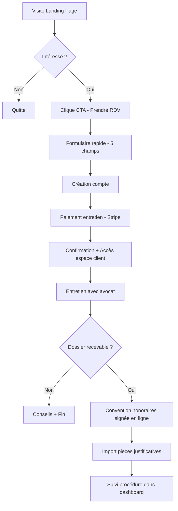
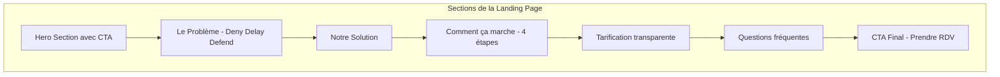
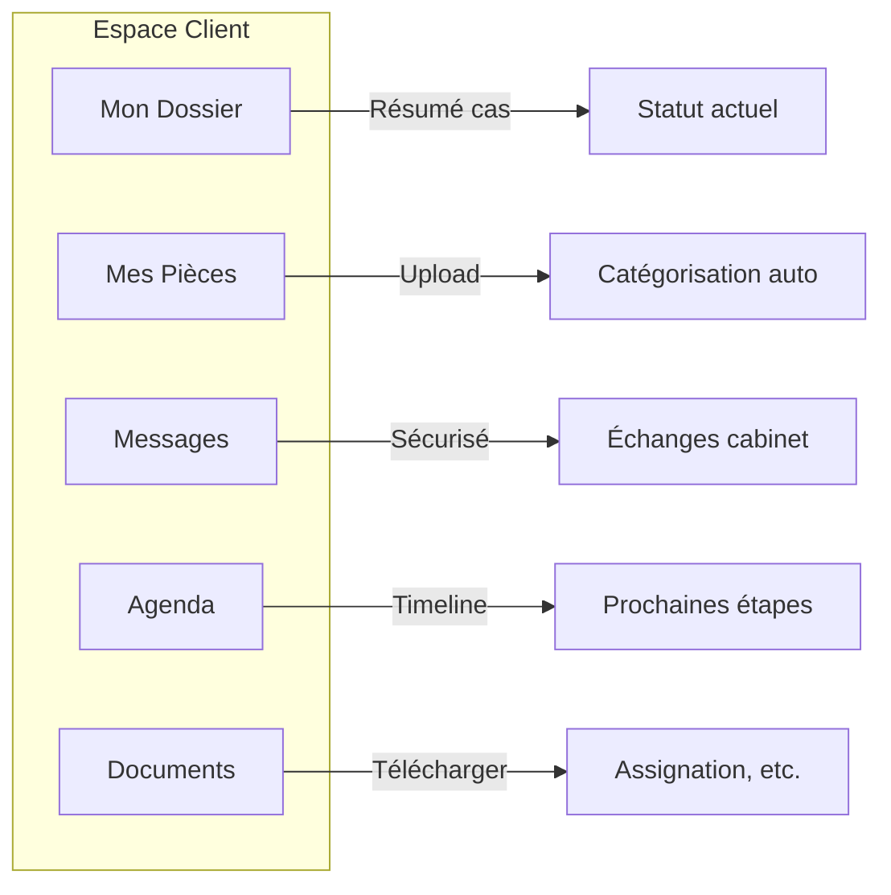
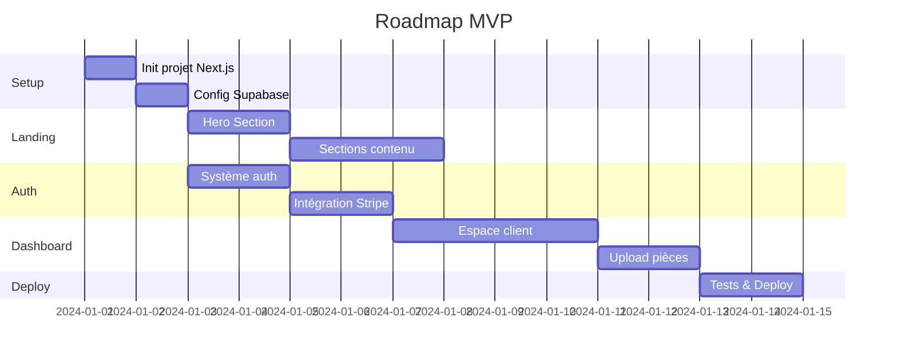

# 🏛️ Plateforme Fraude Bancaire - Assistance Juridique

> **Cabinet spécialisé dans la défense des victimes de fraudes bancaires**

## 📋 Vision du Projet

Plateforme juridique permettant aux victimes de fraude bancaire d'accéder à une défense de qualité à coût maîtrisé, grâce à l'automatisation des tâches répétitives (classification de pièces, génération de documents).

### Le Problème

Les banques utilisent la technique **"Deny, Delay, Defend"** face aux victimes de fraude :
- Refus systématique de remboursement
- Accusation de négligence du client
- Procédures longues et coûteuses qui découragent les victimes

### Notre Solution

- ✅ Process automatisé = coûts réduits de 40%
- ✅ Expertise d'un ancien magistrat
- ✅ Plateforme ergonomique pour le suivi de dossier

---

## 🏗️ Architecture Technique

### Stack Technologique

| Composant | Technologie | Justification |
|-----------|-------------|---------------|
| Framework | **Next.js 14** (App Router) | SEO natif, performance, Server Components |
| UI Library | **Tailwind CSS + shadcn/ui** | Design moderne, composants accessibles |
| Base de données | **Supabase** (PostgreSQL) | Auth intégrée, stockage fichiers, temps réel |
| Paiement | **Stripe** | Fiable, conforme RGPD |
| Hébergement | **Vercel** | Déploiement automatique, CDN global |

### Structure du Projet

```
corentin-app/
├── app/
│   ├── (marketing)/        # Landing page, pages publiques
│   ├── (auth)/             # Connexion, inscription
│   ├── (client)/           # Espace client protégé
│   └── (avocat)/           # Back-office avocat (Phase 2)
├── components/
│   ├── ui/                 # Composants shadcn/ui
│   ├── landing/            # Composants landing page
│   └── dashboard/          # Composants espace client
├── lib/
│   ├── supabase/           # Client et helpers Supabase
│   ├── stripe/             # Intégration paiement
│   └── utils/              # Utilitaires
└── public/
    └── assets/             # Images, icônes
```

---

## 🔄 Parcours Utilisateur



---

## 📄 Structure Landing Page



### Message Commercial

**Accroche principale (Hero):**
> "Victime de fraude bancaire ? Votre banque refuse de rembourser ? **Nous les assignons.**"

**Sous-accroche:**
> "Cabinet spécialisé dans la défense des victimes de fraudes au faux conseiller. Tarifs maîtrisés grâce à notre process optimisé."

**Les 3 piliers:**
1. **Expertise** - Ancien magistrat, spécialiste du contentieux bancaire
2. **Efficacité** - Process automatisé = coûts réduits de 40%
3. **Combativité** - 85% de succès sur les dossiers acceptés

---

## 🎨 Design System

### Palette de Couleurs

| Élément | Couleur | Code | Usage |
|---------|---------|------|-------|
| Primaire | Bleu marine | `#1e3a5f` | Confiance, sérieux juridique |
| Accent | Or/Bronze | `#c9a227` | Prestige, victoire |
| Danger | Rouge bordeaux | `#8b0000` | Urgence, alertes banques |
| Fond | Blanc cassé | `#fafaf9` | Lisibilité |
| Texte | Gris anthracite | `#1f2937` | Lecture confortable |

### Typographie

- **Titres:** Playfair Display (serif élégant, autorité)
- **Corps:** Source Sans Pro (lisibilité, moderne)

---

## 👤 Espace Client (Dashboard)

### Fonctionnalités MVP



### Catégories de Pièces

- 📄 Relevés de compte
- 📸 Captures virements frauduleux
- 📧 Échanges avec la banque
- 🚔 Dépôt de plainte
- 🪪 Pièce d'identité
- 🏠 Justificatif de domicile

---

## 🔍 SEO & Acquisition

### Mots-clés Cibles (Google Ads)

| Mot-clé | Intention |
|---------|-----------|
| avocat fraude bancaire | Transactionnelle |
| se faire rembourser fraude bancaire | Transactionnelle |
| banque refuse remboursement fraude | Transactionnelle |
| faux conseiller bancaire recours | Informationnelle |
| assignation banque fraude | Transactionnelle |

### Stratégie SEO

- Pages dédiées par type de fraude
- Blog avec articles éducatifs
- FAQ enrichie (schema.org)
- Témoignages clients

---

## 📅 Roadmap MVP



---

## 🚀 Démarrage Rapide

```bash
# Cloner le repo
git clone https://github.com/NMajster/Corentin-app.git
cd Corentin-app

# Installer les dépendances
npm install

# Configurer les variables d'environnement
cp .env.example .env.local

# Lancer en développement
npm run dev
```

---

## 📝 License

Projet privé - Tous droits réservés

---

## 👥 Contact

**Cabinet d'Avocat**  
Barreau de Paris  
Spécialiste contentieux bancaire

