# 🏛️ Plateforme de Défense des Épargnants

> **Rétablir le rapport de force face aux institutions financières**

## 📋 Vision du Projet

### Mission

Permettre aux particuliers floués par les institutions bancaires, assurantielles ou financières d'accéder à une **justice de qualité à un coût compatible avec leur préjudice**.

Face aux grandes institutions qui utilisent la technique **"Deny, Delay, Defend"** (nier, retarder, défendre), les clients sont souvent démunis. Le coût d'une procédure judiciaire dépasse fréquemment l'enjeu financier, décourageant toute action.

### Notre Approche

Grâce à l'**automatisation intelligente** (classification de pièces, génération de documents juridiques), nous réduisons drastiquement le coût de traitement des dossiers, rendant ces procédures économiquement viables.

### Roadmap Multi-Contentieux

```mermaid
flowchart LR
    subgraph phase1 [Phase 1 - MVP]
        Fraude[Fraude Bancaire]
    end
    
    subgraph phase2 [Phase 2]
        Assurance[Litiges Assurance]
        Credit[Crédit conso abusif]
    end
    
    subgraph phase3 [Phase 3]
        Investissement[Placements toxiques]
        Crypto[Arnaques crypto]
        Autres[Autres contentieux]
    end
    
    phase1 --> phase2 --> phase3
```



| Phase | Contentieux | Cible |
|-------|-------------|-------|
| **Phase 1** | Fraude bancaire (faux conseiller) | Victimes de spoofing, phishing |
| **Phase 2** | Assurances, crédits abusifs | Clients lésés par refus de garantie |
| **Phase 3** | Investissements, crypto | Victimes de placements toxiques |

---

## 🎯 Phase 1 : Fraude Bancaire

### Le Problème Spécifique

Les banques utilisent la technique **"Deny, Delay, Defend"** face aux victimes de fraude :
- Refus systématique de remboursement
- Accusation de négligence du client
- Procédures longues et coûteuses qui découragent les victimes

### Notre Solution

- Process automatisé = coûts réduits de 40%
- Expertise d'un ancien magistrat
- Plateforme ergonomique pour le suivi de dossier

---

## 🏗️ Architecture Technique

### Stack Technologique

| Composant | Technologie | Justification |
|-----------|-------------|---------------|
| Framework | **Next.js 14** (App Router) | SEO natif, performance, Server Components |
| UI Library | **Tailwind CSS + shadcn/ui** | Design moderne, composants accessibles |
| Base de données | **Supabase** (PostgreSQL) | Auth intégrée, stockage fichiers, temps réel |
| Paiement | **Stripe** | Fiable, conforme RGPD |
| Hébergement | **Vercel** | Déploiement automatique, CDN global |

### Structure du Projet

```
corentin-app/
├── app/
│   ├── (marketing)/        # Landing page, pages publiques
│   ├── (auth)/             # Connexion, inscription
│   ├── (client)/           # Espace client protégé
│   └── (avocat)/           # Back-office avocat (Phase 2)
├── components/
│   ├── ui/                 # Composants shadcn/ui
│   ├── landing/            # Composants landing page
│   └── dashboard/          # Composants espace client
├── lib/
│   ├── supabase/           # Client et helpers Supabase
│   ├── stripe/             # Intégration paiement
│   └── utils/              # Utilitaires
└── public/
    └── assets/             # Images, icônes
```

---

## 🔄 Parcours Utilisateur

```mermaid
flowchart TD
    A[Visite Landing Page] --> B{Intéressé ?}
    B -->|Non| Z[Quitte]
    B -->|Oui| C[Clique CTA - Prendre RDV]
    C --> D[Formulaire rapide - 5 champs]
    D --> E[Création compte]
    E --> F[Paiement entretien - Stripe]
    F --> G[Confirmation + Accès espace client]
    G --> H[Entretien avec avocat]
    H --> I[Convention honoraires signée en ligne]
    I --> J[Import pièces justificatives]
    J --> K[Rédaction courriers]
    K --> L[Mise en demeure banque]
    L --> M{Réponse banque ?}
    M -->|Remboursement| N[Dossier clos - Succès]
    M -->|Refus| O[Rédaction assignation]
    O --> P[Procédure judiciaire]
    P --> Q[Suivi dans dashboard]
```



---

## 📄 Structure Landing Page

```mermaid
flowchart TB
    subgraph sections [Sections de la Landing Page]
        Hero[Hero Section avec CTA]
        Problem[Le Problème - Deny Delay Defend]
        Solution[Notre Solution]
        Process[Comment ça marche - 4 étapes]
        Pricing[Tarification transparente]
        FAQ[Questions fréquentes]
        CTA_Final[CTA Final - Prendre RDV]
    end
    
    Hero --> Problem --> Solution --> Process --> Pricing --> FAQ --> CTA_Final
```



### Message Commercial

**Accroche principale (Hero):**
> "Victime de fraude bancaire ? Votre banque refuse de rembourser ? **Nous les assignons.**"

**Sous-accroche:**
> "Cabinet spécialisé dans la défense des victimes de fraudes au faux conseiller. Tarifs maîtrisés grâce à notre process optimisé."

**Les 3 piliers:**
1. **Expertise** - Ancien magistrat, spécialiste du contentieux bancaire
2. **Efficacité** - Process automatisé = coûts réduits de 40%
3. **Combativité** - 85% de succès sur les dossiers acceptés

---

## 🎨 Design System

### Palette de Couleurs

| Élément | Couleur | Code | Usage |
|---------|---------|------|-------|
| Primaire | Bleu marine | `#1e3a5f` | Confiance, sérieux juridique |
| Accent | Or/Bronze | `#c9a227` | Prestige, victoire |
| Danger | Rouge bordeaux | `#8b0000` | Urgence, alertes banques |
| Fond | Blanc cassé | `#fafaf9` | Lisibilité |
| Texte | Gris anthracite | `#1f2937` | Lecture confortable |

### Typographie

- **Titres:** Playfair Display (serif élégant, autorité)
- **Corps:** Source Sans Pro (lisibilité, moderne)

---

## 👤 Espace Client (Dashboard)

### Fonctionnalités MVP

```mermaid
flowchart LR
    subgraph dashboard [Espace Client]
        Dossier[Mon Dossier]
        Pieces[Mes Pièces]
        Messages[Messages]
        Agenda[Agenda]
        Documents[Documents]
    end
    
    Dossier --> |Résumé cas| Status[Statut actuel]
    Pieces --> |Upload| Categories[Catégorisation auto]
    Messages --> |Sécurisé| Cabinet[Échanges cabinet]
    Agenda --> |Timeline| Etapes[Prochaines étapes]
    Documents --> |Télécharger| Generated[Assignation, etc.]
```



### Catégories de Pièces

- 📄 Relevés de compte
- 📸 Captures virements frauduleux
- 📧 Échanges avec la banque
- 🚔 Dépôt de plainte
- 🪪 Pièce d'identité
- 🏠 Justificatif de domicile

---

## ⚖️ Back-Office Avocat

### Architecture Générale

```mermaid
flowchart TB
    subgraph donnees [Sources de Données Client]
        Profil[Profil inscription]
        Formulaire[Formulaire post-entretien]
        Pieces[Pièces importées]
    end
    
    subgraph backoffice [Back-Office Avocat]
        Bibliotheque[Bibliothèque de modèles]
        Editeur[Éditeur de document]
        Indexation[Système indexation pièces]
        Bordereau[Générateur bordereau]
    end
    
    subgraph output [Sortie]
        PDF[Export PDF final]
        Dossier[Dossier complet numéroté]
    end
    
    Profil --> Editeur
    Formulaire --> Editeur
    Bibliotheque --> Editeur
    Pieces --> Indexation
    Indexation --> Bordereau
    Editeur --> PDF
    Bordereau --> PDF
    Indexation --> Dossier
```



### Gestion des Modèles

| Élément | Description |
|---------|-------------|
| **Bibliothèque** | Stockage des modèles dans Supabase |
| **Matières** | Plusieurs modèles par type de contentieux |
| **Versioning** | Historique des modifications |

### Structure des Documents

Chaque modèle contient 3 types de zones :


| Type de zone | Comportement | Exemple |
|--------------|--------------|---------|
| **Auto-remplie** | Données injectées automatiquement depuis profil + formulaire | Nom, prénom, adresse, date/lieu naissance |
| **Fixe** | Verrouillée par défaut, modifiable sur demande | Mentions légales, formules juridiques |
| **Libre** | Rédaction manuelle par l'avocat | "Les Faits", argumentation |

### Système d'Indexation des Pièces

```mermaid
flowchart TD
    A[Avocat rédige assignation] --> B[Indexe une pièce du client]
    B --> C[Numérotation automatique]
    C --> D[Pièce 1, Pièce 2, etc.]
    D --> E[Mise à jour bordereau]
    E --> F[Rubrique pièces numérotées]
    F --> G[Export PDF complet]
    
    subgraph bordereau [Bordereau de Pièces]
        H[Liste récapitulative]
        I[Numérotation séquentielle]
        J[Modifiable par avocat]
    end
    
    E --> bordereau
```



| Fonctionnalité | Description |
|----------------|-------------|
| **Indexation** | L'avocat référence des pièces client dans le document |
| **Numérotation auto** | Les pièces sont numérotées dans l'ordre d'insertion |
| **Bordereau** | Document récapitulatif généré automatiquement |
| **Modification** | Le bordereau reste modifiable |
| **Export PDF** | Pièces renumérotées dans une rubrique dédiée |

### Flux de Données

```mermaid
sequenceDiagram
    participant Client
    participant EspaceClient as Espace Client
    participant BackOffice as Back-Office
    participant Supabase
    
    Client->>EspaceClient: Remplit profil inscription
    EspaceClient->>Supabase: Stocke données profil
    Client->>EspaceClient: Remplit formulaire complémentaire
    EspaceClient->>Supabase: Stocke données complémentaires
    Client->>EspaceClient: Importe pièces justificatives
    EspaceClient->>Supabase: Stocke fichiers
    
    BackOffice->>Supabase: Charge modèle + données client
    BackOffice->>BackOffice: Auto-remplit zones
    BackOffice->>BackOffice: Avocat rédige parties libres
    BackOffice->>BackOffice: Indexe pièces client
    BackOffice->>BackOffice: Génère bordereau
    BackOffice->>Supabase: Sauvegarde document
    BackOffice->>EspaceClient: Document disponible pour client
```



---

## 🔍 SEO & Acquisition

### Mots-clés Cibles (Google Ads)

| Mot-clé | Intention |
|---------|-----------|
| avocat fraude bancaire | Transactionnelle |
| se faire rembourser fraude bancaire | Transactionnelle |
| banque refuse remboursement fraude | Transactionnelle |
| faux conseiller bancaire recours | Informationnelle |
| assignation banque fraude | Transactionnelle |

### Stratégie SEO

- Pages dédiées par type de fraude
- Blog avec articles éducatifs
- FAQ enrichie (schema.org)
- Témoignages clients

---

## 📅 Roadmap MVP


---

## 🚀 Démarrage Rapide

```bash
# Cloner le repo
git clone https://github.com/NMajster/Corentin-app.git
cd Corentin-app

# Installer les dépendances
npm install

# Configurer les variables d'environnement
cp .env.example .env.local

# Lancer en développement
npm run dev
```

---

## 📝 License

Projet privé - Tous droits réservés

---

## 👥 Contact

**Cabinet d'Avocat**  
Barreau de Paris  
Spécialiste contentieux bancaire

